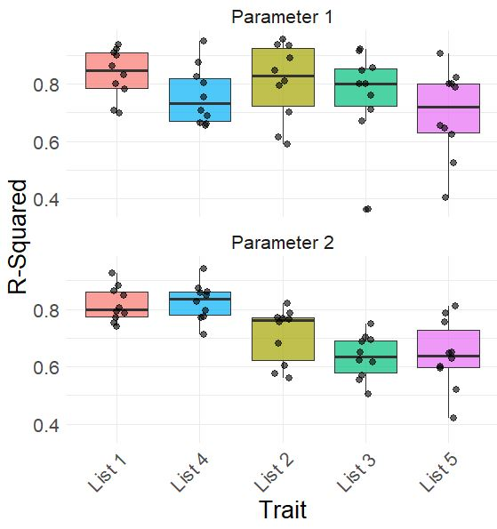

# SenCat-Companion
This group of scripts collectively performs feature selection within groups of predictor variables using penalized linear regression, and validates these feature groups using out-of-sample parameter prediction.

**R Script Names:**  

Elastic Net Feature Selection - Continuous Parameters.R  
Cross Validation of Selected Features - Continuous Parameters.R  
Effect Size - Composite Scores and Seno-Age Gaps.R  
Effect Size - Individual Predictors.R  
Elastic Net Feature Selection - Binary Parameters.R  
Cross Validation of Selected Features - Binary Parameters.R  
Cox Proportional Hazards Modeling - Composite Scores and Parameters.R  

## Overview  
Elastic net is a form of penalized linear regression that performs feature selection by shrinking beta coefficients of predictor variables using a penalty term, 
the stength of which is determined using a hyperperamater lambda, with a smaller lambda selecting more predictor terms, and larger selecting fewer. A range of values are used for lambda for cross validation, and ultimately the model using the lambda value and selected features that produces the lowest mean squared error (MSE) are found. In this way, Elastic Net can be used to identify important features, for example gene expression levels, implicated in clinical parameters (age, bmi, etc.).

One limitation of elastic net modeling using common R functions such as cv.glmnet is the variability of the output, as folds for cross validation are selected randomly. This function ensures reproducibility during elastic net modeling by setting explicit fold IDs, then uses the selected features within a simple linear model and performs cross validation reprodicibly using the caret package. Additional features include auto-scaling of features, parallel processing for faster output, and producing a table indicating out-of-sample predictive ability of each set of features and for each parameter, as well as a list of selected features per parameter.

## Function: Elastic Net Feature Selection - Continuous Parameters.R  

**Arguments**  
| Parameter       | Type        | Description                                                                                             |
|----------------|-------------|---------------------------------------------------------------------------------------------------------|
| `clin_df `     | `dataframe` | Table of microarray data containing gene expression values and covariates by columns, sample IDs by row |
| `protein_list` | `vector `   | Vector of genes from which to perform feature selection, and any continuous covariates                  |
| `control_list` | `vector `   | Vector of categorical covariates                                                                        |
| `trait_list`   | `vector `   | Vector of continuous traits for which to select implicated features                                     |
| `alpha`        | `numeric `  | Number indicating hyperparameter alpha (0 for ridge, 1 for lasso, in-between for Elastic Net)           |
| `interations`  | `numeric `  | Number indicating the number of times the analysis will be run                                          |

**Return Values:**  
- Coef is a table showing the penalized effect size of each feature for each supplied trait.
- Lambda is a table showing the supplied alpha and optimized lambda across many runs for each parameter of the trait_list.
- Heatmap is a graphical representation of the penalized effect size of each feature for each supplied trait.

  

- IVSum is a bar graph respresenting the number of selected features for each supplied parameter. Example image shows 100 possible features and 2 covariates.

  

## Function: Cross Validation of Selected Features - Continuous Parameters.R   

**Arguments**  
| Parameter       | Type        | Description                                                                                                    |
|----------------|-------------|-----------------------------------------------------------------------------------------------------------------|
| `clin_df `     | `dataframe` | Table of microarray data containing gene expression values and covariates by columns, sample IDs by row         |
| `protein_list` | `vector `   | Vector containing lists of genes from which to perform feature selection                                        |
| `cat_control`  | `vector `   | Vector of categorical covariates                                                                                |
| `cont_control` | `vector `   | Vector of continuous covariates                                                                                 |
| `trait_list`   | `vector `   | Vector of continuous or categorical traits for which to select implicated features                              |
| `alpha`        | `numeric `  | Number indicating hyperparameter alpha (0 for ridge, 1 for lasso, in-between for Elastic Net)                   |
| `num_ensp`     | `numeric `  | Number indicating a limit of features selected per paramter                                                     |
| `composite`    | `boolean `  | Boolean value determining selected features will be condensed into a mean composite score                       |
| `direction`    | `string `   | String "up" or "down" indicating if features positively or negatively associated with parameters will be used   |

**Return Values**    
- df_master_Rsquared is a table containing R-Sqaured values from ten rounds of cross validation for each list of features and for each parameter.

| Rsquared       | Feature List| Parameter         |
|----------------|-------------|-------------------|
| 0.38           | Tissue 1    | Parameter 1       |
| 0.43           | Tissue 1    | Parameter 2       |
| 0.29           | Tissue 1    | Parameter 3       |
| 0.40           | Tissue 1    | Parameter 4       |
| 0.35           | Tissue 1    | Parameter 5       |
| 0.53           | Tissue 2    | Parameter 1       |
| 0.61           | Tissue 2    | Parameter 2       |
| 0.70           | Tissue 2    | Parameter 3       |
| 0.59           | Tissue 2    | Parameter 4       |
| 0.65           | Tissue 2    | Parameter 5       |

- df_master_ensp is a vector of tables that shows the selected features from each list of features and for each parameter.

| Parameter 1    | Parameter 2    | Parameter 3    |
|----------------|----------------|----------------|
| Feature 1      | Feature 2      | Feature 8      |
| Feature 8      | Feature 4      | Feature 10     |
| Feature 12     | Feature 6      | Feature 14     |
| Feature 15     | Feature 10     | Feature 29     |
| Feature 18     | Feature 13     | Feature 33     |
| Feature 21     | Feature 19     | Feature 39     |
| Feature 23     | Feature 20     | Feature 41     |
| Feature 24     | Feature 39     | Feature 44     |
| Feature 31     | Feature 42     | Feature 45     |
| Feature 49     | Feature 50     | Feature 47     |

Result dataframes are configured for easy plotting to compare predictive ability of models trained using each list of features.  

  

## Dependencies:  
glmnet  
ggplot2   
doParallel
caret

## Author  
Bradley Olinger, PhD  
b.a.olinger@gmail.com

